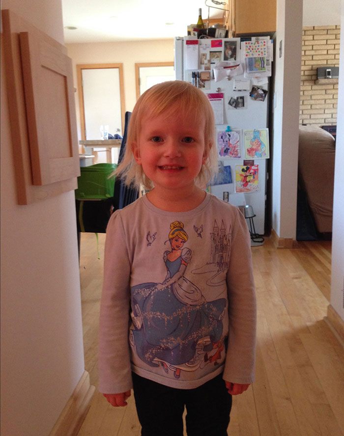
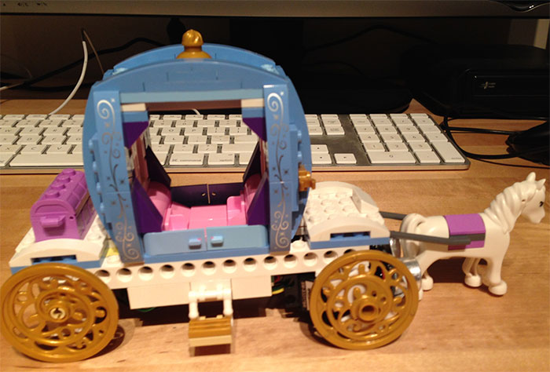
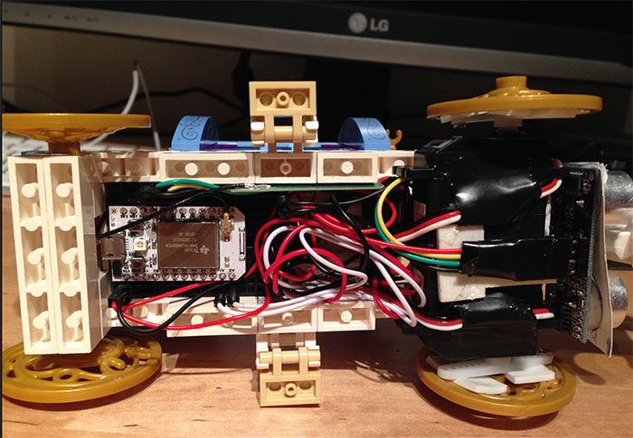
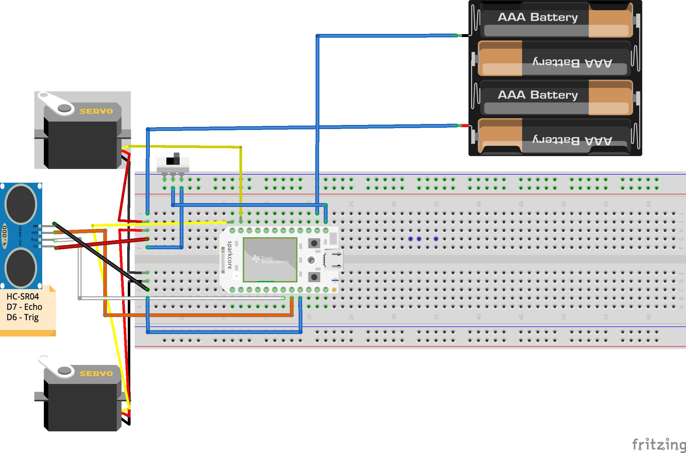
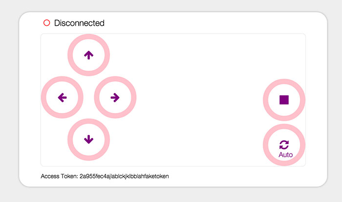

# So you want to build a motorized princess carriage?

## Meet Kate



I'm three and a half.  I love drawing, painting, playing go fish, dollhouses, and above all princesses. (BTW, this is me on my way to see the new Cinderella movie.  I loved it! :)

## Why build a motorized carriage?

Being a software developer, I would love for my daughter to get involved with technology at a young age and learn that building robots can be just as cool as playing with a doll.  Well, almost... With that in mind, I wanted to try to bridge the gap between the two worlds.

## Introducing Cinderella's new and improved carriage.



Kate and I spent a few weekends putting together the [lego kit](http://www.amazon.com/Disney-Princess-41053-Cinderellas-Carriage/dp/B00GSN5F0I/ref=sr_1_1?ie=UTF8&qid=1427488907&sr=8-1&keywords=cinderella+lego+carriage) for Cinderella's carriage with a few improvements.  We added continous rotation servos to the wheels, a spark core for controlling movement & wireless connection, and an ultrasonic sensor for object detection.



Here is the underside wired up with the motors, spark, mini breadboard, and a little double sided tape.

## Wiring
Power comes from a 4 AA battery pack which provides 6v and can power the servos, ultrasonic sensor and the spark core. The servos are hooked up to the A0 and A1 pins, which the spark will write a position value to.  We used continuous rotation servos, which a bit different than normal servos.  Writing a value of 90 to the servo will essentially stop it.  A value of 0 or 180 will cause the servo to spin either clockwise or counter-clockwise.  



## Remote Control
One unique feature about the spark core over an arduino is it has a built in wireless chip.  Combined with the spark cloud, you can send messages to your carriage while it is in action over the internet.  Upon startup, the default action is for the carriage to drive along and avoid objects and walls using the ultrasonic sensor.  (Similar to a roomba vacuum, without the vacuum)  However, with the remote you can send a command to the carriage to put it in "manual" mode.  Commands include forward, backward, left, right, stop or back to "auto" mode.  The remote is just a simple webpage, but it could be accessed on a phone or tablet if you wanted touch capabilities.



## Code

The code for the remote is located in the "remote" folder.  It is a simple html page which uses ajax to send commands to the spark.

All the code for the carriage is located in cinderella.ino.  One thing to note.  In our setup() function we setup the "hook" for the spark to listen for manual commands.

```c
Spark.function("manual", manualControl);
```

The loop() function (which repeats on an interval) will either scan for objects in the carriage's path or will process a manual command.  The rest are all helper functions.


## Conclusion

At the beginning I was thinking, how much can a 3 and 1/2 year old really do?  It turns out, quite a bit.  She did everything from wiring up stuff on the breadboard to picking colors for our remote control to hitting enter on curl requests while debugging.  Now she even asks to "play motors".  Hopefully this repository will be helpful for other parents looking for ways to introduce technology to their children :) Feedback is welcome!
